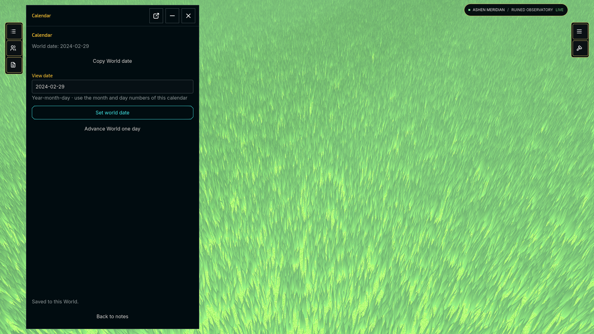
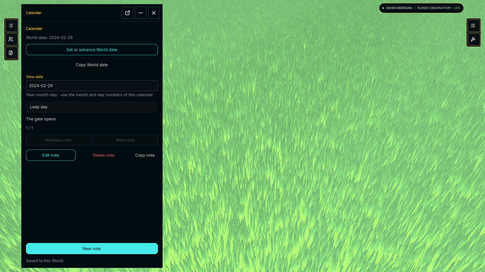

# Calendar

An ordinary optional Rookframe Package, developed throughout Project 02. It
opens an authored date view and dated-note editor from the left Rail.
The GM sets or advances the saved World date and maintains dated notes. The example uses
classic Gregorian or custom calendar rules; it requires no remote account.

Package ID: `aae579da-5392-4507-8eaa-0d918af58076`.
Package version: `0.9.0`. SDK Edition: `2029`, minimum revision `1`.





These are native Rookframe desktop captures of Calendar 0.9.0, using the
controlled System Extension for the tabletop. Calendar owns the date-and-notes
window; the host owns the surrounding workspace and durable World save.

## Clean clone

Install Godot **4.7.2** with matching export templates, Git, Python **3.10+** and
the **.NET 8 runtime**. No Rookframe application checkout or private host
assemblies are required. The gd-plug bootstrap and its license are included.

```sh
git clone --branch v0.9.0 https://github.com/rookframe/rookframe-calendar.git
cd rookframe-calendar
/path/to/godot --headless --path . --script plug.gd install
python3 addons/rookframe_sdk/rookframe_authoring.py facade --project .
python3 addons/rookframe_sdk/rookframe_authoring.py check --project . --godot /path/to/godot
python3 addons/rookframe_sdk/rookframe_authoring.py build --project . --godot /path/to/godot --output build/Calendar-0.9.0.rookpackage
```

The two dependencies in `plug.gd` are SDK **v0.9.0** and UI Kit
**v1.0.0-rc.1** at exact commit
`238339d390ec01873585c002917c164948a0578d`. The independent authoring lock is
`.rookframe/authoring.lock.json`. Ordinary commands do not update either pin.
The generated facade is committed as Package-owned source; it is not a third
dependency or hand-written host adapter.

Open `project.godot` in Godot. The SDK plugin checks/generates the facade when
entering the editor, and Project → Tools offers Package Check and Build. Open
`rookframe/packages/aae579da-5392-4507-8eaa-0d918af58076/ui/window.tscn` to edit or
run the normal authored scene. The UI uses the separately installed public Theme, TextField and TextArea components, with authored summary panels. Rookframe owns the Rail slot and managed window chrome.

Calendar has no OS dependency. The same published `.rookpackage` supplies its
shared code and resources on iOS, Android, Linux, macOS and Windows. Its phone,
tablet and desktop Presentations select the appropriate layout; Rookframe uses
the documented Presentation fallback when a layout is absent. Use a Rookframe
build containing the RFG-231 portability fix.

The immutable v0.9.0 release was produced by its pinned SDK, which used the legacy
`desktop` archive-member label. That label does not restrict where Calendar can
run. Reinstall the published archive unchanged. SDK 0.9.2 and newer author one
shared `package` artifact, with all required texture formats included automatically.
A new build receives a fresh UUID. No publication or account is needed to build
locally.

In Rookframe, create a World with a controlled System Extension. Open Main Menu → Installed Packages → Import Local Archive, choose
the build. In World Details → Packages, include Calendar. Open the World and click Calendar's document
icon in the left Rail. Its initial scene opens in the normal managed window,
with dock, float, minimize, restore and close behavior. The entire selection
passes ordinary production admission before execution.

See the [SDK authoring guide](https://github.com/rookframe/rookframe-sdk) and
[UI Kit component API](https://github.com/rookframe/rookframe-ui-kit/blob/238339d390ec01873585c002917c164948a0578d/docs/public-components.md).
Calendar 0.9.0 is checked against Rookframe 0.1.0 with SDK Edition 2029 revision 1 support.

## How the integration is authored

`ui/desktop.gd`, `ui/tablet.gd` and `ui/phone.gd` extends the generated SDK Presentation base. Rookframe binds
its typed `sdk` automatically before `compose()`:

```gdscript
const CALENDAR_WINDOW_BUTTON: SDK.WindowButton = preload("res://rookframe/packages/aae579da-5392-4507-8eaa-0d918af58076/ui/window_button.tres")

func compose() -> void:
    var rail: SDK.Rail = sdk.rails.left
    rail.push(CALENDAR_WINDOW_BUTTON)
```

Open `ui/window_button.tres` in Godot's Inspector. Its `button_scene` points to
`ui/calendar_button.tscn`; its typed `window` target points to `ui/window.tscn`.
Edit the button's appearance in its scene and the Calendar content in the window
scene. The SDK owns the standard opening action, native instantiation, mounting,
reopening and cleanup. There is no Package-written signal connection, host
adapter, string-based mount call or rejected-control disposal.

Paths in this section are beneath `rookframe/packages/aae579da-5392-4507-8eaa-0d918af58076/`.

## Date and note workflow

Choose **Set or advance World date** to change the World date, then **Back to notes** to browse the selected date. **New note** and **Edit note** open the compact editor; **Save note** returns to the saved list.

The supported range is **0001-01-01 through 9999-12-31**, using the proleptic
Gregorian calendar and canonical `YYYY-MM-DD` spelling. A leap year is divisible
by 4, except century years must also be divisible by 400. There are no time zones,
real-world scheduling rules, recurrence, reminders or external accounts.

A new World has no Calendar data until its GM enters a valid date and explicitly
presses **Set world date**. **Advance one day** changes the saved World date,
including month/year/leap-day boundaries. The maximum date cannot advance.
Changing **View date** only browses notes and changes the date for a new draft.
Invalid input leaves the committed state unchanged.

Enter a title and body and press **Save note** to create a dated note. Browse the
selected date with **Previous note** / **Next note**, choose **Edit note** to load
that note into the draft, save the edit, or choose **Delete note**. **New note**
explicitly starts a new draft. Accepted changes refresh from the public SDK and
survive leave/reopen and host-owned Copy/export/recovery. Failed saves never show
success; a durable failure ends the World so reopening restores its prior save.

The canonical value belongs to Rookframe's automatically scoped Package World
Data Handle. Calendar stores pure values (`schema`, ISO World date, notes and next
note ID), so retaining it never requires Calendar scripts. `CalendarData`,
`CalendarNote`, and `GregorianDate` are temporary typed helpers, acquired afresh for
each operation; only UI selection and an unfinished draft stay in the window.
No copied Actor/Rook records, calendar database, host calendar schema, synchronized
Node tree or additional replication system exists. A release that cannot interpret
retained values reports that state without rewriting them. GM access comes from
the host context, never an identity or flag supplied by Calendar.

Run the focused domain checks (they are excluded from Package exports):

```sh
python3 tests/run_domain_tests.py --godot /path/to/godot
```

They cover Gregorian boundaries, explicit initialization, invalid/range input,
note creation/edit/deletion, dated browsing and interpreting a newly supplied copy
of the saved pure value. The host's focused SDK/store tests cover authorization,
real codec round-trips, failed durable saves, retention and recovery.

Desktop, tablet and phone Presentations register the same authored window scene,
so an unfinished note and navigation state survive switching, closing and
reopening. The host uses its current logical canvas and owns docking, floating,
minimizing, orientation and shutdown. Drafts end when leaving the World.
The date helper is temporary typed calculation state, not authoritative data.
German translations are declared as a normal Godot Translation and accessed
through `sdk.translations`; the standalone scene keeps English source labels.

## Calendar Settings

Open **Game Menu → Package Settings → Calendar**. World Settings contains the
Calendar title and a choice between classic Gregorian rules and a custom calendar.
Custom calendars have 1–64 named months, each with 1–366 days, and 1–32 named
weekdays. Month and weekday names must be distinct within their list. Weeks run
continuously across month/year boundaries. Custom years repeat their month lengths
without leap days; classic rules retain Gregorian leap years.

My Settings chooses numeric or named date display. Presentation is a separate
section. Edits are staged until the containing scope's Save button succeeds.
Only the World Authority GM can publish calendar rules.

Changing rules relabels existing days instead of rewriting history. Day 1 of year 1
is the common origin; retained Gregorian dates remain the canonical day identity
in Package World Data, so every note stays attached to the same day. Numeric
custom input uses year-month-day numbers in the selected calendar, for example
`0001-02-03`; changing rules can change those labels and the displayed year.
The supported day range remains Gregorian 0001-01-01 through 9999-12-31.
Older Calendar releases can still read the retained dates and notes.

The public SDK uses typed `TextListSetting`, `IntegerListSetting`, `TextList`,
and `IntegerList` values; the custom view builds drafts through typed setters.
This requires Edition 2027 revision 7 and SDK 0.6.0.


## Copy a date or note

**Copy date** copies the displayed World date using the active classic/custom
rules and this user's date format. **Copy note** copies the selected saved note's
title and body. Both use the public typed scoped clipboard service and report
success or the device's unavailable/denied outcome. Copying needs no network
provider, account or sign-in. Calendar remains fully useful offline.


## Manager lifecycle acceptance

[The release lifecycle guide](docs/manager-lifecycle.md) covers installation,
exact updates, disabled releases, matching repair and deliberate data removal.
Calendar 0.8.1 preserves the 0.8.0 pure date/notes representation and SDK 0.8.0
contract. Manager changes require Rookframe's RFG-230 release.


## Catalogue release 0.9.0

The public Manifest for this exact release is
[rookframe.json](https://github.com/rookframe/rookframe-calendar/releases/download/v0.9.0/rookframe.json).
The same release contains [Calendar-0.9.0.rookpackage](https://github.com/rookframe/rookframe-calendar/releases/download/v0.9.0/Calendar-0.9.0.rookpackage).
The archive and Manifest are one checked build; retries reuse them and never
replace a published version. The Package ID remains unchanged. The upgrade
retains the previous pure date/notes representation and existing calendar settings.

Install from this Manifest link in Manager or, after its submission is approved,
find Calendar 0.9.0 in Browse Catalogue and choose Install this release. Include
it in a World with exactly one System Extension, open the World, and select its
Calendar rail entry. Local archive import works independently of Catalogue.
A listing is metadata and does not certify or authenticate Package code.

Maintainers publish from a clean checkout of the exact source commit, with the
pinned dependencies installed, using the SDK's separate deliberate command:

```sh
python3 addons/rookframe_sdk/rookframe_authoring.py publish-github \
  --project . --archive build/Calendar-0.9.0.rookpackage \
  --repo rookframe/rookframe-calendar --tag v0.9.0 --commit FULL_SOURCE_COMMIT
# Review the printed exact build/destination, then repeat with --confirm.
python3 addons/rookframe_sdk/rookframe_authoring.py catalogue propose \
  --manifest https://github.com/rookframe/rookframe-calendar/releases/download/v0.9.0/rookframe.json \
  --output /private/path/calendar-proposal.json
# Review the proposal, then submit explicitly:
python3 addons/rookframe_sdk/rookframe_authoring.py catalogue submit \
  --proposal /private/path/calendar-proposal.json --confirm
```

Publisher registration, email confirmation and sign-in are documented in the
[SDK publication guide](https://github.com/rookframe/rookframe-sdk/blob/v0.9.0/PUBLICATION.md).
They are only needed for the Catalogue record. Building, testing and direct
installation need no Publisher account. The existing custom calendar/settings
features remain part of Calendar; this release introduces no new date model.
